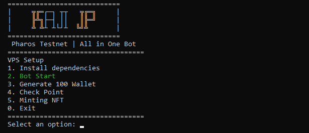

# 🚀 Pharos-Bot | Bot Airdrop Testnet


# Langkah Awal
- Daftar Disini :  [Pharos Testnet](https://testnet.pharosnetwork.xyz/experience?inviteCode=Ospeomjme8qJ15kG )
- Connect New Wallet
- Connect X & Discord Account

Bot otomatis untuk menyelesaikan semua task Pharos Testnet — termasuk check-in, faucet, swap token, transfer antar wallet, hingga staking. Semua dilakukan langsung via transaksi di blockchain  TX

---

## 🔧 FITUR UTAMA

| Fitur              | Keterangan                                                             |
|--------------------|------------------------------------------------------------------------|
| 🔐 Login Otomatis   | Login via tanda tangan wallet (tanpa email/password)                  |
| 📅 Auto Check-in    | Check-in harian otomatis                                               |
| 💧 Auto Faucet      | Klaim token faucet testnet otomatis setiap wallet                      |
| 🔄 Auto Swap        | Swap token menggunakan smart contract (real transaction)              |
| 💸 Auto Transfer    | Kirim token ke wallet random                                           |
| 🪙 Auto Staking     | Stake token otomatis ke smart contract staking                         |
| 📊 Laporan Akun     | Menampilkan poin dan status wallet                                     |
| 💡 Multi Wallet     | Bisa jalankan banyak wallet sekaligus                                  |
| 🔗 TX Explorer Link | Tampilkan link TX langsung ke explorer (https://testnet.pharosscan.xyz) |

---

## 📂 STRUKTUR FILE

| File              | Deskripsi                                                               |
|-------------------|-------------------------------------------------------------------------|
| `bot.py`          | File utama bot, sudah all-in-one                                        |
| `.env`            | Konfigurasi setting (fitur aktif, jumlah TX, delay, dll)               |
| `privateKeys.txt` | List private key (1 wallet per baris)                                   |
| `abi.txt`         | ABI smart contract (token, router, staking)                             |

---

## 🛠️ PERSIAPAN SEBELUM RUNNING

### 1. Download atau Clone Repositori

```
git clone https://github.com/kajijp/pharos-bot.git
```
```
cd pharos-bot && chmod +x setup.sh
```

### Masukkan Privatekey di accounts.txt
```
nano accounts.txt
```
### Jalankan Bot
```
./setup.sh
```
```
# Pilih 1 untuk Intall semua Dependensi yang dibutuhkan
# Pilih 2 untuk Jalankan Bot auto pharos testnet
# Pilih 3 untuk Generate 100 wallet (privatekey auto tersimpan di privakeKeys.txt)
# Pilih 4 untuk Cek Poin yang sudah kalian dapatkan
# Pilih 5 untuk Minting NFT
# Pilih 0 untuk Keluar dari bot

```


# 🚀 PHAROS AUTO - Auto Mint NFT (Testnet) via Termux

Script Python untuk **otomatis mint NFT** di Pharos Testnet menggunakan **multi wallet** + **proxy support**.  
✅ Aman, tidak double mint  
✅ Cek saldo otomatis  
✅ Link explorer disediakan  
✅ Cocok untuk dijalankan di Termux (Android)

---

## 🛠️ Fitur

- 🚀 Auto Mint NFT di jaringan Pharos Testnet
- 🔁 Multi wallet + proxy rotasi otomatis
- 💰 Deteksi saldo sebelum kirim tx
- 💾 Simpan riwayat mint di `datanft.txt`
- 🔗 Link transaksi langsung ke PharosScan

---

<br><br><br>
🔥 Mohon dukungan agar KajiJP semakin berkembang, like dan gabung ke channel kami, sebarkan dan undang teman anda, terima kasih, Insyaallah JP!
## 🌐 Komunitas KajiJP
Gabung dan ikuti info terbaru:
- 💬 [Telegram](https://t.me/kajijp)
- 🎮 [Facebook](https://facebook.com/kajijp)
- 🐦 [X / Twitter](https://x.com/wakkajijp)
- ▶️ [Youtube](https://www.youtube.com/@KajiJP)

